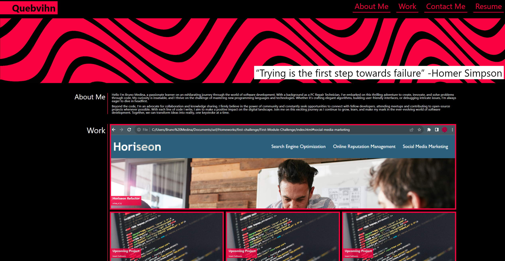
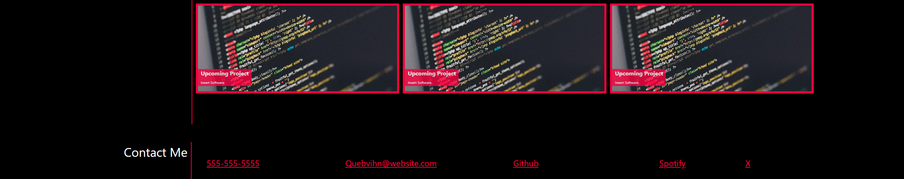

# Portfolio Website

Welcome to my beginner portfolio website! This project was created to showcase my skills and projects while implementing the use of HTML, CSS with flexbox, media queries, and CSS variables to ensure a responsive and visually appealing design.

## Navigation

You can easily navigate through my portfolio using the links provided above or through the navigation menu at the top of the page. Just click on the section you want to explore, and the UI will scroll to the corresponding content.

## Responsive Design

This portfolio was designed intended to be fully responsive. Whether you're viewing it on a desktop computer, tablet, or smartphone, the layout was intended to adapt to your viewport to ensure an optimal user experience.

Thank you for visiting my portfolio website! 
